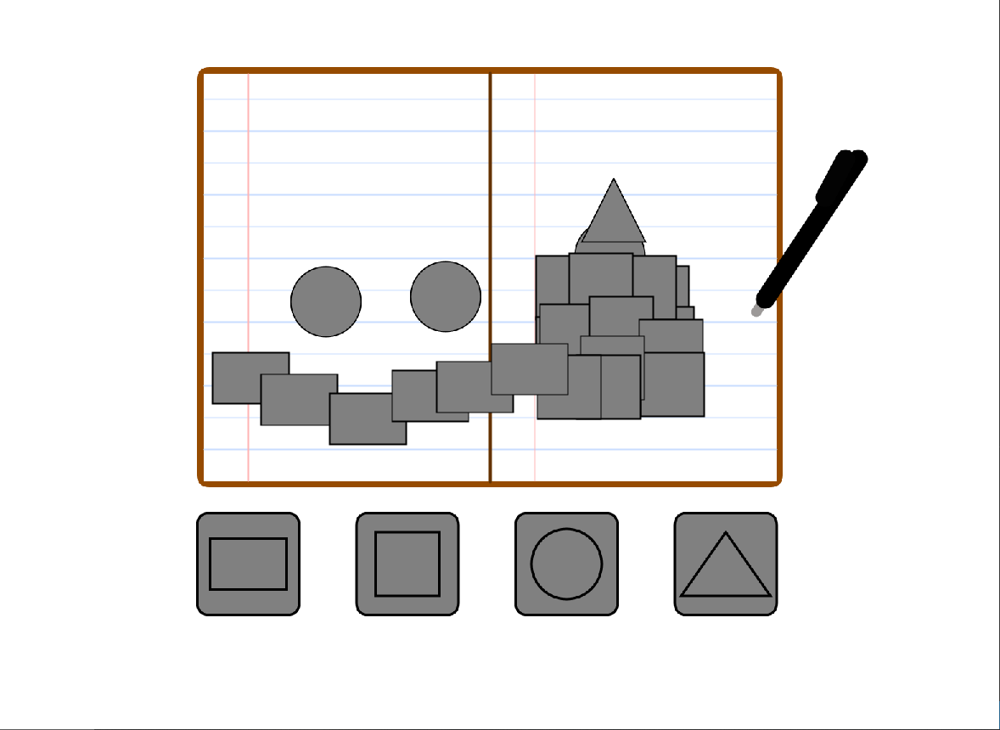

# ICS3U CPT – Interactive Processing Project

## Description:

    A sketch that draws a digital notebook where users can
select common shapes from the user interface to place on the blank paper. 
It also includes a custom pen cursor that follows the mouse movement.

## User Interactivity:

Pick up a tool: Click on one of the four square outline boxes at the bottom of the window interface (Rectangle, Square, Circle, or Triangle) to pick that up.

Place a Shape: Move your custom pen cursor over to the inside of the white notebook paper and click to stamp the chosen shape onto the page.

Move Your Cursor: Move your mouse around to control where the 2D custom pen lives.

## Limitation:

The color and size of the shapes are not able to be changed, they must consistently be gray with the given size. 

There is no eraser, so you should just reload it. 

Everything used came from Processing Core PApplet. 